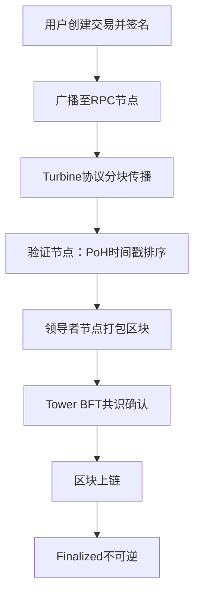

以下是针对 Solana 交易生命周期、BPF 加载器工作原理及账户存储模型对比的详细说明，结合技术细节与可视化逻辑整理：

---

### 🔄 **一、Solana 交易生命周期流程图**  
Solana 交易从发起至最终确认分为以下核心阶段，其并行处理机制显著提升效率：  
1. **交易创建与签名**  
   - 用户通过钱包/DApp 生成指令（如转账、合约调用），并签名确保合法性。  
2. **广播与传播**  
   - 签名交易通过 RPC 节点广播，借助 **Turbine 协议**将数据分块传输至全网。  
3. **验证与排序**  
   - 验证节点（Validators）利用 **PoH（历史证明）** 生成全局时间戳，预检签名与余额，通过 **Gulf Stream 协议**推送给未来领导者节点。  
4. **区块打包与共识**  
   - 领导者节点（Leader）基于 PoH 排序打包交易，通过 **Tower BFT 共识**快速确认区块，并分发给验证节点。  
5. **上链与最终确认**  
   - 区块追加至分布式账本，交易状态生效。超过 31 个区块确认后视为 **Finalized（不可逆）**。  

> 💡 **关键特性**：  
> - **并行执行**：非冲突交易（如访问独立账户）由多线程同时处理。  
> - **无全局内存池**：交易直接转发给领导者节点，减少延迟。

---

### ⚙️ **二、BPF 加载器工作原理图**  
BPF（Berkeley Packet Filter）是 Solana 智能合约的沙盒执行引擎，工作流程如下：  
1. **编译与加载**  
   - 合约代码（Rust/C）通过 **LLVM/Clang** 编译为 BPF 字节码，经系统调用 `bpf()` 加载至内核。  
2. **安全验证**  
   - **验证器（Verifier）** 检查字节码：禁止循环、控制流可达性、寄存器/栈状态安全。  
3. **JIT 编译与挂载**  
   - 通过验证的字节码由 **JIT 编译器**转换为本地机器码，挂载到内核钩子点（如系统调用、网络事件）。  
4. **事件驱动执行**  
   - 触发事件（如交易调用）时，BPF 程序通过 **Helper 函数**访问内存，结果存入 **eBPF Map**（供用户态读取）。  

> 💡 **核心优势**：  
> - **安全隔离**：程序运行于沙盒中，无法破坏内核。  
> - **高效执行**：JIT 编译减少解释开销，并行处理提升吞吐量。

---

### 🔀 **三、账户存储模型对比（Solana vs EVM）**  

| **特性**               | **Solana**                            | **EVM（如以太坊）**               |  
|------------------------|---------------------------------------|-----------------------------------|  
| **账户类型**           | 统一账户模型： - **程序账户**（存储代码，不可写） - **数据账户**（存储状态，由程序所有者控制） | 分两类： - **EOA**（外部账户，仅余额/nonce） - **CA**（合约账户，含代码+存储槽） |  
| **数据存储位置**       | 数据与代码分离： - 数据存储在独立账户中，需显式初始化（`init`） | 合约状态存储在自身存储槽（`SSTORE`），自动分配空间 |  
| **访问权限**           | - 所有账户数据**公开可读** - 仅**所有者程序**可写入数据 | - 合约存储**仅自身可修改** - 外部合约/用户需通过接口读取 |  
| **存储成本机制**       | **租金模型（Rent）**： - 账户需预留足够 SOL 豁免租金，否则可能被回收 | **一次性付费**： - 存储槽占用后无持续费用，但可能导致链膨胀 |  
| **特殊账户**           | - **PDA**（程序派生地址，无私钥） - **ATA**（关联代币账户，自动管理） | 无直接等效，依赖合约逻辑（如代理合约） |  
| **存储灵活性**         | 数据账户可达 **10MB**，支持结构化数据 | 存储槽为 **32字节** 键值对，需复杂结构时需额外设计 |  

> 💡 **设计差异总结**：  
> - **Solana**：强调**无状态程序+外部存储**，通过账户所有权和租金优化资源。  
> - **EVM**：合约**内置存储**简化开发，但可能牺牲效率与可扩展性。

---

### 💎 **结论**  
Solana 通过 **并行交易处理**、**BPF 安全沙盒** 和 **解耦的账户模型**，实现高吞吐与低延迟。其设计尤其适合高频应用（如 DeFi、NFT），但开发者需适应显式初始化、租金管理等新范式。EVM 开发者转向 Solana 时，应重点关注账户所有权与数据存储的外部化特性。